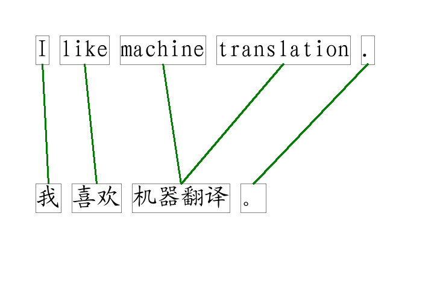
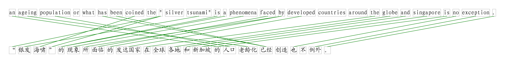

alignment-viewer
================
Introduction
------------
This script visualizes alignments between two sentences.

Machine translation, paraphrasing systems often need to use alignments. Examining the word level alignment between two sentences is helpful for tuning such systems. This script visualizes the alignment structure between two sentences.

Input

 1. two sentences (e.g. one in English -- "I like machine translation .", and one in Chinese -- "我 喜欢 机器翻译 。")
 2. the alignment between them (e.g. the first English word is aligned with the first Chinese word)

Output

1. A PNG image visualizing the two sentences, and the alignments between them

Installation
------------
This script is written in [Python2](http://www.python.org/getit/). Once you have Python2 and the following dependent libraries installed, the installation of this software is just one click away -- You may simply download the **draw_alignment.py** file, and you're good to go.

The two dependent libraries are listed below

1. Google flags library -- [python-gflags](https://code.google.com/p/python-gflags/)
2. Python Image Library -- [PIL](http://www.pythonware.com/products/pil/)

Usage
-----

###Analyzing Alignments produced by GIZA++
[GIZA++](https://code.google.com/p/giza-pp/) is an awesome software that produces word level alignments for a list of sentences and their translations. We use it all the time in our researches, but its alignment output only contains a list of numbers, which is hard to interprete.

We typically feed two files to GIZA++, containing sentences in one language, and their translations in another language. For example

*Eng.txt*

    the government should not limit the amount spent on the aged because this problem is becoming more and more prevalent in singapore .
    an ageing population or what has been coined the " silver tsunami" is a phenomena faced by developed countries around the globe and singapore is no exception .
    ...
    
*Chs.txt*

    ， 因为 这个 问题 变 得 越来越 普遍 ， 在 新加坡 ， 政府 不 应该 限制 对 老年 花费 的 金额 。
    “ 银发 海啸 ” 的 现象 所 面临 的 发达国家 在 全球 各地 和 新加坡 的 人口 老龄化 已经 创造 也 不 例外 。
    ...
    
GIZA++ is able to produce the alignments between sentences in the two files.

*Align.txt*

    2-14 12-2 13-3 21-10 8-16 3-13 20-9 15-4 1-12 5-19 6-20 11-1 10-17 0-11 4-15 19-7 22-21 7-18 17-8 15-6 
    21-12 17-9 7-2 9-3 20-10 13-4 9-0 12-4 11-1 0-15 5-18 2-16 1-17 26-22 24-15 23-14 22-13 16-6 6-18 16-8 15-7 14-5 27-23 25-20 
    ...
    
You may wonder whether such alignments can be useful for your applications. You may wonder whether the alignments are acceptable, or have trouble deciding whether the alignments' quality is acceptable. My program helps you visualize the alignments. The following command will generate the alignment of the second sentence into *output.png*.

    python draw_alignment.py Eng.txt Chs.txt Align.txt 2 output.png
    
In the above case, output.png will contain the following image

###Using the Package as an External Library
You want to debug your new alignment algorithm, but have trouble analyzing its output? You have a new alignment algorithm that you want to write about, but drawing the diagram just takes too long?  You may call the *DrawDirAlignToFile* function to produce a pretty picture for your purpose.

*Syntax: DrawDirAlignToFile(src_sentence, trg_sentence, alignments, output_imagefile)* 

The following code will generate the alignment illustrated above.

    import draw_alignment
    draw_alignment.DrawDirAlignToFile("I like machine translation .", u"我 喜欢 机器翻译 。", [(0, 0), (1, 1), (2, 2), (3, 2), (4, 3)], "test.png")
